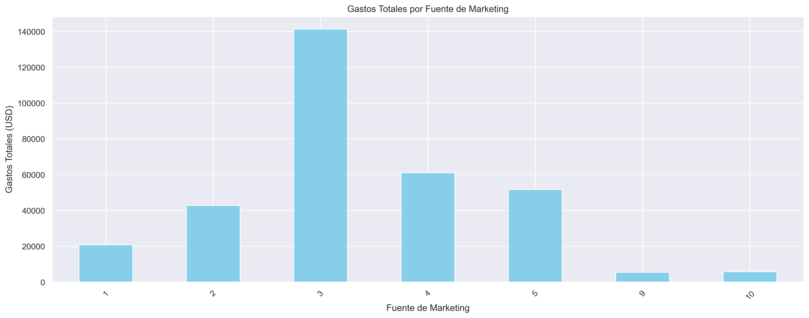
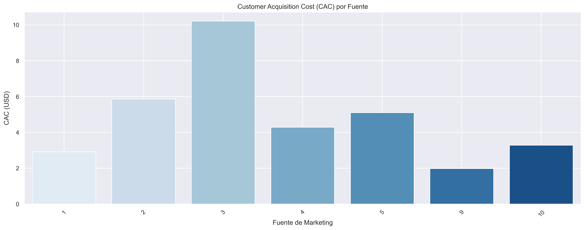
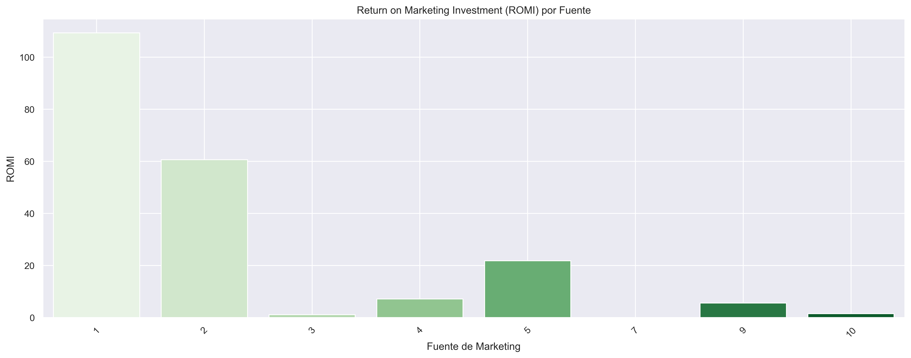

# Resumen Ejecutivo - Optimización de Gastos de Marketing 

## 1. Fuentes/Plataformas Ganadoras

### Identificación de las fuentes más efectivas:

A partir del análisis de las métricas clave **LTV (Lifetime Value)**, **CAC (Costo de Adquisición de Clientes)** y **ROMI (Retorno sobre la Inversión en Marketing)**, hemos identificado las fuentes de marketing más eficientes para Showz.

#### **Fuente 1**:
- **LTV**: La fuente 1 es la más rentable a largo plazo, con un **LTV significativamente alto** (promedio de **$1344**).
- **ROMI**: Esta fuente también presenta un **ROMI sobresaliente** de **109.31**, lo que demuestra que el retorno generado por cada dólar invertido es muy positivo.
- **CAC**: Aunque tiene un **CAC de 2.92**, que es moderado, la rentabilidad de la inversión compensa el costo de adquisición.

#### **Fuente 9 y Fuente 10**:
- **CAC bajo**: Estas fuentes presentan un **CAC muy bajo**, lo que las convierte en opciones atractivas para **adquisiciones de bajo costo**.
- **ROMI moderado**: Aunque su **ROMI** es más bajo que el de la Fuente 1, el **bajo CAC** sugiere que con pequeñas optimizaciones en LTV podrían ser más rentables.
  

#### **Conclusión**:
- **Fuente 1** es la fuente **más eficiente** en términos de **ROMI** y **LTV**, y debe ser la principal plataforma para **invertir fuertemente**.
- **Fuente 9** y **Fuente 10** deben ser **optimizada** para mejorar el **LTV**, pero se deben mantener por su bajo **CAC**.

---

## 2. Presupuesto Óptimo: Monto y Distribución de Inversión

A partir de los análisis realizados, proponemos una distribución óptima del presupuesto de marketing para maximizar los resultados.

### **Distribución recomendada del presupuesto:**

1. **Fuente 1**: Invertir **el 50% del presupuesto** en esta fuente. La excelente rentabilidad de su inversión justifica este **alto porcentaje**.
2. **Fuente 9**: Asignar **20%** del presupuesto. A pesar de su bajo ROMI, su **bajo CAC** la convierte en una opción eficiente a largo plazo.
3. **Fuente 10**: Invertir **20%** en esta fuente, similar a la Fuente 9, para seguir aprovechando su bajo costo.
4. **Fuentes 2-8**: El restante **10%** debe distribuirse entre las fuentes con **bajo rendimiento**. Estas fuentes deben evaluarse cuidadosamente para **optimizar su rendimiento** o reducir la inversión en el futuro.

---

## 3. Rentabilidad de Inversiones - ROMI por Fuente

### **Análisis de ROMI**:
- **Fuente 1** lidera con un **ROMI de 109.31**, lo que significa que cada dólar invertido en esta fuente genera un retorno significativo.
- Las **Fuentes 2, 3 y 4** tienen un **ROMI menor**, pero aún así son rentables en comparación con otras plataformas.

---

## 4. Supuestos y Limitaciones del Análisis

### **Supuestos**:
1. Los datos utilizados son **completos** y **representativos** del comportamiento real de los usuarios de Showz.
2. Se asumió que las **fuentes de marketing** no han tenido cambios significativos durante el período analizado, y que las métricas de **LTV** y **CAC** continuarán siendo consistentes.
3. El análisis de **ROMI** y **LTV** no incluye variables externas como **cambios estacionales** o eventos imprevistos, lo que podría alterar el comportamiento de los usuarios.

### **Limitaciones**:
1. **Datos de costos** y **ingresos** están disponibles solo hasta el **2018**, por lo que el análisis no captura tendencias más recientes.
2. El análisis de **LTV** se basa en una suposición de que los usuarios se comportarán de manera similar a lo largo del tiempo, sin tener en cuenta posibles cambios en la **fidelización** o en el comportamiento de compra.
3. **Fuente de marketing**: Algunos canales podrían no estar completamente representados en los datos, lo que limita el análisis a las fuentes disponibles.

---

## Conclusión Final

El análisis de **Marketing** ha identificado que **Fuente 1** es la plataforma más rentable en términos de **ROMI** y **LTV**, por lo que se recomienda aumentar la inversión en esta fuente.  
Las **Fuentes 9 y 10** tienen un **bajo CAC**, pero su **LTV y ROMI** deben ser optimizados para aumentar la rentabilidad.

La distribución óptima del presupuesto debe centrarse en **Fuente 1** y buscar mejorar el rendimiento de las fuentes con bajo **LTV**, como **Fuente 9** y **Fuente 10**.  
Las **fuentes de marketing con bajo rendimiento** deben ser reevaluadas o despriorizadas en futuras inversiones.

Con lo que propuse, Showz podrá optimizar su inversión en marketing, **maximizar su retorno sobre la inversión** y **mejorar la captación de usuarios rentables**.

---

